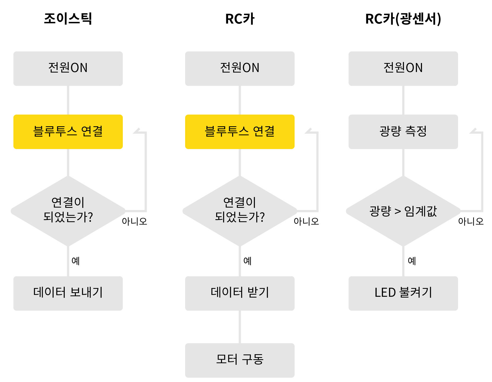

# HAEDAL_Makers_DIYRCCAR
  

  
---

### 학습 목표  
- RCcar를 아두이노 기반의 각종 센서와 함께 직접 구현해보고, 구조를 이해하며 임베디드 지식을 함양합니다.
  
 
 
 

### 알고리즘 
 

 
 
 

### 구현 기능
 

- 조이스틱 ↔ RC카 통신 시스템   
  
    조이스틱과 RC카의 블루투스 통신을 통해 RC카의 모터를 제어합니다.   

- 부저 시스템   
  
    경적 소리를 내며, 후진할 때 멜로디를 연주합니다.   

- 광원 감지 시스템  
  
    어두워지면 자동으로 **전방 LED**가 켜집니다.

- 전원 LED 시스템  

    RC카의 초기화가 끝나면 **전원 LED**가 켜집니다.

 
 

---
 
### 아두이노 NANO 드라이버 설치 파일
 

- **CH341SER.ZIP** 파일을 다운받으신 후, 메뉴얼 절차에 따라주시기 바랍니다.  
 
---
 

## 코드 정리 
 

[JoyStick_1_OnlyJoystick.ino](JoyStick_1_OnlyJoystick/JoyStick_1_OnlyJoystick.ino)

[JoyStick_1_Bluetooth.ino](JoyStick_1_Bluetooth/JoyStick_1_Bluetooth.ino)

[JoyStick_1_FINAL.ino](JoyStick_1_FINAL/JoyStick_1_FINAL.ino)

[RCcar_bluetooth.ino](RCcar_bluetooth/RCcar_bluetooth.ino)

[RCcar_Motor.ino](RCcar_Motor/RCcar_Motor.ino)

[RCcar_Bluetooth_Motor.ino](RCcar_Bluetooth_Motor/RCcar_Bluetooth_Motor.ino)

[RCcar_Buzzer.ino](RCcar_Buzzer/RCcar_Buzzer.ino)

[RCcar_Buzzer_F_.ino](RCcar_Buzzer_F_/RCcar_Buzzer_F_.ino)

[RCcar_Light_fLED.ino](RCcar_Light_fLED/RCcar_Light_fLED.ino)

[RCcar_rLED.ino](RCcar_rLED/RCcar_rLED.ino)

[RCcar_FINAL.ino](RCcar_FINAL/RCcar_FINAL.ino)

